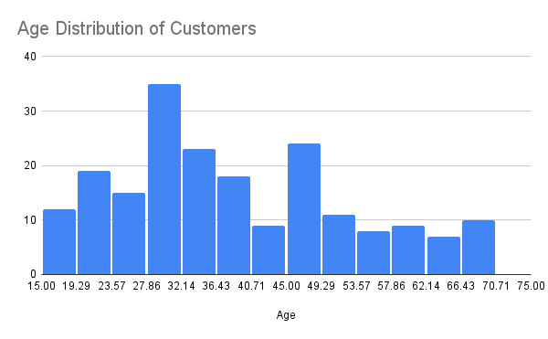
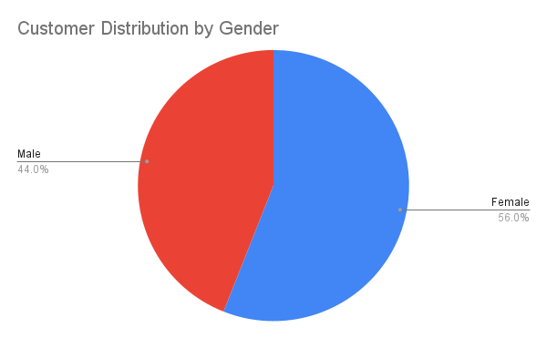

# Customer Segmentation Analysis

## Dataset
Mall Customers Dataset (200 customers)

## Tools Used
Google Sheets  
Data Cleaning  
Data Visualization  

## Objective
Analyze customer demographics and spending behavior to identify potential customer segments.

## Key Insights

• Customers with high income and high spending scores represent the most valuable segment.

• Most customers fall between 20 and 40 years old.

• Female customers represent a slightly larger proportion of the dataset.

## Visualizations

### Income vs Spending

### Age Distribution

### Gender Distribution

